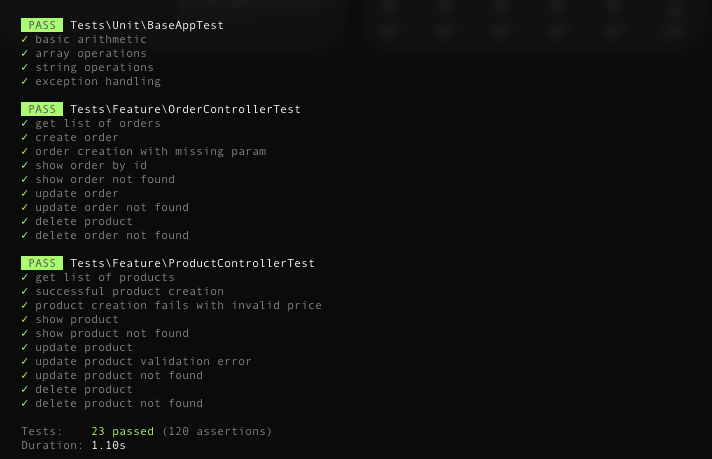

# Orders-manager
System to monitor and manage daily user orders.

## Architecture Overview
<div align="center">
	
</div>

## Project Setup

### Requirements:
- Docker
- Docker Compose

### Steps to Run the Project:
1. Clone the repository: `git clone https://github.com/ostin-power/orders-manager.git`
2. In the root directory copy .env.example: `cp .env.example .env`
3. Change any conf values you need such as ports or db name **(it is advisable to keep the default values)**
2. Run `docker-compose up --build -d`.
3. Run `docker ps` to make sure that application is up&running.
4. Run `docker exec -it <api-container-name> php artisan migrate:fresh` to run database migrations
5. Run `docker exec -it <api-container-name> php artisan db:seed` to create fake data to make some tests
6. Access the API at `localhost:9005` and the frontend at `localhost:8080`.

## API Endpoints:
- `GET /api/v1/orders`: Fetch all orders with optional filters.
- `GET /api/v1/orders/{order}`: Fetch a specific order by ID.
- `GET /api/v1/products`: Fetch all products.
- `GET /api/v1/products/{product}`: Fetch a specific product by ID.
- `POST /api/v1/orders`: Create a new order.
- `POST /api/v1/products`: Create a new product.
- `PUT /api/v1/orders/{order}`: Update an existing order.
- `PUT /api/v1/products/{product}`: Update an existing product.
- `DELETE /api/v1/orders/{order}`: Delete an order.
- `DELETE /api/v1/products/{product}`: Delete an order.

### Backend API Swagger documentation
You can try backend APIs from Swagger interface: this will simplify your tests or give a powerful instrument to use api without the Frontend application. For more details about Endopoints, once your containers are up&running, go to :
```bash
http://localhost:<backend_api_port>/api/documentation
```


## Tests
### Prerequisites
Before running the tests, ensure that all the required dependencies and Docker containers are running. You will need:

- Docker and Docker Compose installed.
- The necessary services (app, API, and database) running using Docker Compose.

**Make sure that you ran database migration in previous setup steps** 
```bash
docker exec -it <api-container-name> php artisan migrate:fresh
```

### Running Tests
1. **Bring Up the Docker Environment**: if the containers are not already running, use Docker Compose to start them:
```bash
docker-compose up --build
```

This will start the following services:
- app: The main application running on port 8080.
- api: The API service running on port 9005.
- db: The MySQL database running on port 3306.

2. Running Unit and Feature Tests on both backend and frontend<br>
To run the tests use the following commands:
```bash
docker exec -it <orders-app-container> php artisan test
docker exec -it <orders-api-container> php artisan test
```

Wait for the output. It would be like this:
<div align="center">
	
</div>

**After test execution, if you want clean database, run again the database seed to clean data:** 
```bash
docker exec -it <api-container-name> php artisan migrate:fresh
docker exec -it <api-container-name> php artisan db:seed
```

## Troubleshooting
### Containers Won't Start or Exit Immediately
1. _Check Container Logs_: to see why a container is exiting or failing to start, view the logs. Check the logs for any errors, such as missing dependencies or incorrect environment configurations :
```bash
docker-compose logs <service_name>
```

2. _Rebuild Containers_: if you've made changes to the Dockerfile or the project source code, you may need to rebuild the containers:
```bash
docker-compose up --build
```

### MySQL Database Fails to Start
1. Incorrect Environment Variables
Ensure that the environment variables for the MySQL service (db) are correctly set in your docker-compose.yml file. Ensure the environment variables are consistent and match your application’s configuration. For example:
```bash
MYSQL_DATABASE: The name of the database (default: ordersdb)
MYSQL_ROOT_PASSWORD: The root password (default: orderspassword)
MYSQL_USER: The user to create (default: admin)
MYSQL_PASSWORD: The password for the user (default: orderspassword)
```


2. Port Conflict
Check if another service is using port 3306. If it's occupied, modify the docker-compose.yml file and change the port mapping:
```bash
ports:
  - "3307:3306"
  ```
  
Then restart the containers:
```bash
docker-compose down
docker-compose up
  ```
  
3. Persistent Volume Issues
If the MySQL container cannot start due to volume corruption, try removing the persistent volume and re-creating it.<br>
**Warning**: This will delete all data stored in the db_data volume.
```bash
docker-compose down -v
docker-compose up
  ```
  
### Application (App or API) Cannot Connect to Database
1. **Verify Network Configuration**<br>
Ensure all services are using the same network. The private network should be defined and used by all services in the docker-compose.yml file:
```bash
networks:
  private:
  ```
2. **Check Database Host**<br>
Verify that the application (either app or api) is using the correct host to connect to the database. In Docker Compose, the service name (db) should be used as the host, not localhost:
```bash
DB_HOST=db
  ```
  If you're using environment variables, ensure the correct ones are passed to the application.
  
3. **Wait for Database Initialization**<br>
The application may attempt to connect to the database before it’s ready. Add a depends_on clause in the application services to ensure the database is up before the app or API starts:
```bash
depends_on:
  - db
  ```
Alternatively, use a wait-for-it script to delay the app's startup until the database is ready.

### Unable to Access App or API on Exposed Ports
1. **Verify Port Mapping**<br>
Check that the ports are correctly mapped in docker-compose.yml. For example, the app service should map port 8080 on the host to port 8000 in the container and similarly the API service should map port 9005:
```bash
ports:
  - "8080:8000"
  
ports:
  - "9005:9005"
  ```
  
### Volume Changes Not Reflecting
If changes made to the code are not reflected in the running containers, ensure that the volumes are correctly mounted:
```bash
volumes:
  - ./src/orders-app:/var/www
  - ./src/orders-api:/var/www
  ```

Make sure the host directories (./src/orders-app and ./src/orders-api) contain the expected files.

These troubleshooting steps should cover most of the common issues encountered with the docker-compose setup for this project. If problems persist, reviewing the container logs and ensuring the configuration matches your development environment will be essential for further debugging.